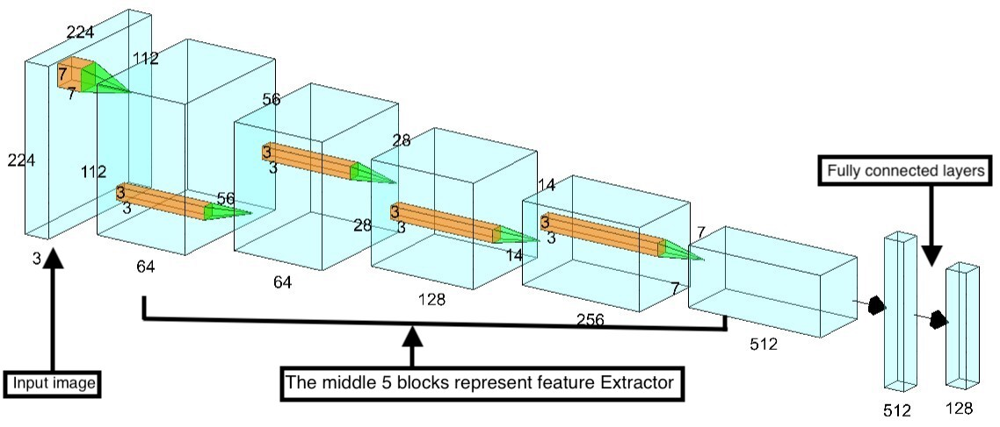
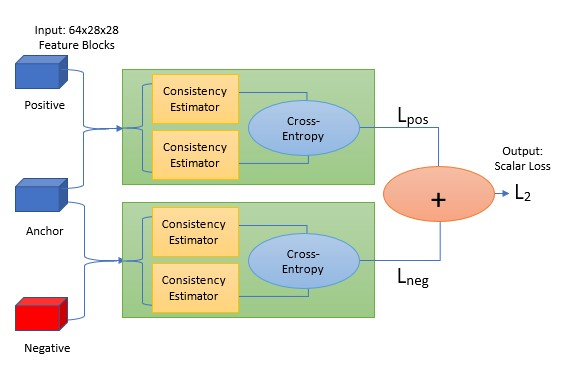
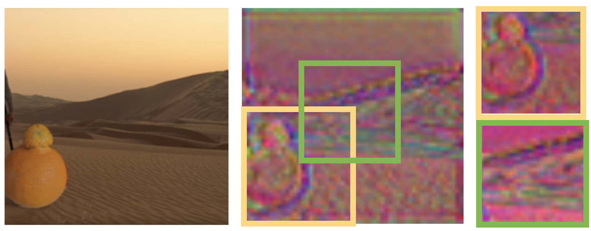
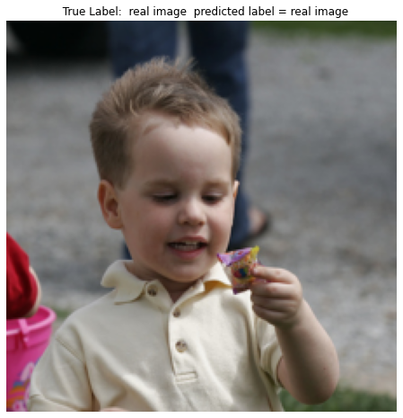
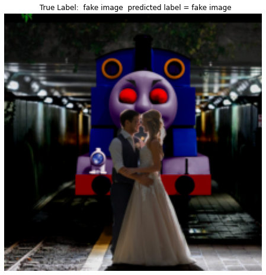
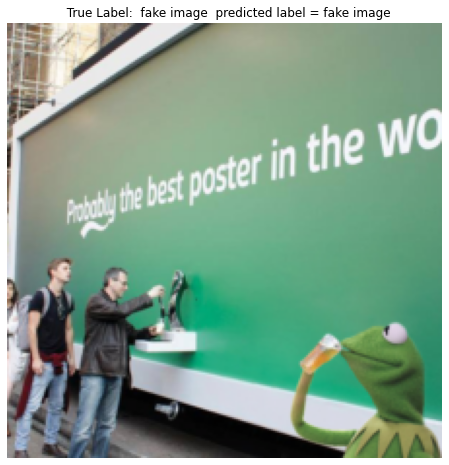

# Efficient Detection of Manipulated Images
**A Computer Vision Project by Nisarg Trivedi, Chenwu Liao, Matt Wilmes for EECS 504, University of Michigan, Ann Arbor.**

We develop a network architecture that combines a Binary Classifier with an Image Self-consistency Estimator. It makes a prediction as to whether an input image is real or fake.

## Stage-1: Binary Classifier
This network takes an image as an input and produces a real versus fake prediction.

Consists of two parts:
- A modified ResNet-18 network used as a feature extractor
- Our own fully connected network used as a classifier

We do data augmentation via rotation, horizontal flipping, and Gaussian blur to improve the training results of our network.

  

## Stage-2: Image Consistency Estimator
This network takes two image patches as an input and determines their consistency.

Consists of a CNN-based Siamese network structure that produces a 2-element output vector indicating how consistent or inconsistent the pair is.

We use contrastive training by taking an anchor patch from a real image and form two pairs with it: one with another patch from that image and one with a patch from a different real image. This allows our network to learn what a consistent versus inconsistent patch-pair looks like.

  

### Sample of patch extraction

  

## Stage-3: Combination
This network combines the models from Stage 1 and Stage 2. We systematically extract 5 patches from the input image and form 10 exhaustive pairs. We use these pairs to generate an inconsistency matrix that is then used to determine whether the image is self-consistent. We take a weighted sum of this output and the sigmoid output of the Binary Classifier to make a determination of whether the image is real or fake.

## Have a look at a few results!

### Successful Real Predictions

  
  
  

### Successful Fake Predictions

  
  
  

